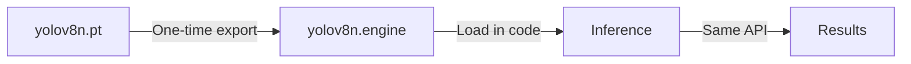

# NVIDIA Optimization Research for Image-Engine
**Research Date:** 2025-11-30
**Target Hardware:** RTX 2080 Ti (Turing, 11GB VRAM)
**Current Stack:** PyTorch 2.5.1+cu121, CLIP, YOLOv8-nano

## Executive Summary

Research identified **four primary optimization paths** for enhancing the current nivo ML analysis pipeline:

1. **TensorRT Runtime Optimization** - Convert existing models to TensorRT engines (2-5x speedup)
2. **NVIDIA TAO Toolkit Models** - Pre-optimized models for vision tasks
3. **NV-CLIP** - NVIDIA's commercial CLIP implementation with TensorRT acceleration
4. **Direct YOLO TensorRT Export** - Ultralytics native TensorRT support

**Recommended Priority:**
1. YOLOv8 TensorRT Export (easiest, highest ROI)
2. CLIP TensorRT Conversion (moderate effort, good speedup)
3. NV-CLIP Evaluation (requires API access)
4. TAO Toolkit Models (most complex, full rewrite)

---

## 1. TensorRT Runtime Optimization

### Overview
TensorRT is NVIDIA's inference optimizer and runtime that optimizes neural network models for production deployment.

### Implementation Paths

#### A. Torch-TensorRT (Recommended)
**Description:** PyTorch-native TensorRT integration
**Repository:** https://github.com/pytorch/TensorRT
**Docs:** https://docs.pytorch.org/TensorRT/

**Installation:**
```bash
# WARNING: CUDA 12.1 support unclear in latest releases
# May need to build from source or use CUDA 11.8/12.6+

# Via pip (check version compatibility)
python -m pip install torch-tensorrt tensorrt \
  --extra-index-url https://download.pytorch.org/whl/cu118

# Or from GitHub releases (check for cu121 builds)
pip install torch-tensorrt -f https://github.com/pytorch/TensorRT/releases
```

**Usage Pattern:**
```python
import torch
import torch_tensorrt

# Load PyTorch model
model = torch.load("model.pth").eval().cuda()

# Compile with TensorRT
trt_model = torch_tensorrt.compile(
    model,
    inputs=[torch_tensorrt.Input((1, 3, 224, 224))],
    enabled_precisions={torch.float16},  # FP16 for 2080 Ti
    workspace_size=1 << 30  # 1GB workspace
)

# Use like normal PyTorch model
output = trt_model(input_tensor)
```

**CUDA Version Issue:**
- Latest releases show support for CUDA 11.8, 12.6+, but NOT 12.1 explicitly
- Current system uses PyTorch 2.5.1+cu121
- **Options:**
  1. Build torch-tensorrt from source with CUDA 12.1
  2. Upgrade to CUDA 12.6+ (requires new PyTorch install)
  3. Downgrade to CUDA 11.8 (not recommended)

#### B. ONNX → TensorRT Path
**Description:** Two-step conversion via ONNX intermediate format
**Tools:** PyTorch → ONNX → TensorRT (trtexec)

**Workflow:**
```python
# Step 1: Export to ONNX
import torch.onnx

dummy_input = torch.randn(1, 3, 224, 224).cuda()
torch.onnx.export(
    model,
    dummy_input,
    "model.onnx",
    opset_version=17,
    input_names=["input"],
    output_names=["output"],
    dynamic_axes={"input": {0: "batch"}, "output": {0: "batch"}}
)

# Step 2: Convert ONNX to TensorRT engine
# Command line: trtexec
trtexec --onnx=model.onnx \
        --saveEngine=model.engine \
        --fp16 \
        --workspace=4096  # 4GB workspace
```

**Python Inference:**
```python
import tensorrt as trt
import pycuda.driver as cuda

# Load engine
with open("model.engine", "rb") as f:
    engine = runtime.deserialize_cuda_engine(f.read())

# Run inference (requires pycuda boilerplate)
context = engine.create_execution_context()
# ... (allocation, memcpy, execution)
```

### Performance Expectations

**General Benchmarks:**
- **FP32 → FP16:** 2-3x speedup (Turing tensor cores)
- **YOLO Models:** Up to 5x speedup (per Ultralytics docs)
- **Vision Transformers (CLIP):** 1.5-2.5x speedup
- **Overall Latency:** 26-240% improvement depending on model

**RTX 2080 Ti Specific:**
- Turing architecture fully supported
- FP16 tensor cores active (best speedup)
- INT8 support (requires calibration, variable accuracy impact)
- Example: YOLOv5 on Jetson (similar Turing) saw 2x speedup

**Expected Image-Engine Gains:**
- YOLOv8-nano: 3-5x → **6-10x with TensorRT**
- CLIP ViT-B/32: Baseline → **1.5-2x with TensorRT**
- Combined pipeline: **2-3x overall throughput**

### Integration Complexity

**Easy:**
- YOLOv8 has native `.export(format='engine')` support
- No code changes beyond export step

**Medium:**
- Torch-TensorRT for CLIP
- Requires installation + compilation step
- PyTorch-like API (minimal code changes)

**Hard:**
- ONNX → TensorRT path
- Custom inference harness with pycuda
- Memory management, I/O handling

### Pros/Cons

**Pros:**
- **Significant speedup** (2-5x for most models)
- **RTX 2080 Ti fully supported** (Turing optimization)
- **FP16 precision** optimal for Turing tensor cores
- **No model retraining** - optimize existing weights
- **Industry standard** - production-ready

**Cons:**
- **CUDA version compatibility unclear** for 12.1
- **Installation complexity** (may need source build)
- **Engine file size** (larger than PyTorch .pth)
- **Platform-specific** (engines compiled per GPU architecture)
- **Limited dynamic shapes** (must define input sizes upfront)

---

## 2. NVIDIA TAO Toolkit Models

### Overview
TAO (Train, Adapt, Optimize) provides 100+ pre-trained vision models optimized for NVIDIA hardware with built-in TensorRT export.

**Website:** https://developer.nvidia.com/tao-toolkit
**Docs:** https://docs.nvidia.com/tao/tao-toolkit/
**NGC Catalog:** https://catalog.ngc.nvidia.com/

### Available Models

#### Classification Models
**Catalog:** https://catalog.ngc.nvidia.com/orgs/nvidia/teams/tao/models/pretrained_classification

**Architectures:**
- ResNet (18, 34, 50, 101)
- EfficientNet (B0-B7)
- VGG (16, 19)
- MobileNet (v1, v2)
- GoogLeNet, SqueezeNet, DarkNet

**Use Case:** Could replace CLIP for scene classification, but zero-shot capability would be lost.

#### Object Detection Models
**Catalog:** https://catalog.ngc.nvidia.com/orgs/nvidia/teams/tao/models/pretrained_object_detection

**Architectures:**
- YOLOv3, YOLOv4, YOLOv4-tiny
- FasterRCNN
- SSD, DSSD
- RetinaNet
- **DetectNet_v2** (NVIDIA proprietary)

**Note:** Already using YOLOv8 from Ultralytics (more recent than TAO's YOLOv4)

#### Foundation Models (TAO 5.5+)
**New in Sept 2024:**
- Multi-modal sensor fusion
- Auto-labeling with text prompts
- Open-vocabulary detection
- Knowledge distillation

### Installation Methods

#### 1. TAO Launcher (Recommended)
```bash
# Install launcher
pip install nvidia-tao

# Launch specific task
tao model classification train -e spec.yaml
```

#### 2. Docker Container
```bash
# Pull TAO PyTorch container
docker pull nvcr.io/nvidia/tao/tao-toolkit:5.5.0-pyt

# Run container
docker run --gpus all -it nvcr.io/nvidia/tao/tao-toolkit:5.5.0-pyt
```

#### 3. Python Wheel (Complex)
```bash
# Many dependencies, not recommended for quick testing
pip install nvidia-tao-pytorch
```

### Workflow

1. **Download pre-trained model** from NGC catalog
2. **Optional:** Fine-tune on custom dataset
3. **Export to TensorRT** via TAO CLI
4. **Deploy** with DeepStream/Triton/TensorRT

**Example:**
```bash
# Download DetectNet_v2 model
ngc registry model download-version \
  nvidia/tao/pretrained_detectnet_v2:resnet18

# Export to TensorRT
tao model detectnet_v2 export \
  -m model.tlt \
  -k key \
  --engine_file model.engine \
  --data_type fp16
```

### System Requirements

**Minimum:**
- 16GB RAM + 16GB GPU RAM
- 8-core CPU
- 100GB SSD storage
- NVIDIA GPU (compute capability 6.0+)

**Supported GPUs:**
- H100, A100, A40, A30, A2, A16
- V100, T4
- **RTX series:** Titan-RTX, Quadro-RTX, **RTX 2080 Ti ✓**

### Performance Expectations

**Pre-optimized for NVIDIA:**
- Models trained on proprietary datasets
- TensorRT export built-in
- Optimized for specific tasks

**Estimated Speedup:**
- DetectNet_v2 FP16: **15-30 FPS** on RTX 2080 Ti (1080p images)
- YOLOv4 FP16: **40-60 FPS** on RTX 2080 Ti (640x640 images)

### Integration Complexity

**Hard:**
- Requires Docker/TAO Launcher installation
- Different training/export workflow than current PyTorch pipeline
- Must learn TAO CLI/config format
- May require fine-tuning for photo analysis use case

**Full Migration:**
- Replace CLIP scene classification with ResNet/EfficientNet (loses zero-shot)
- Replace YOLOv8 with TAO YOLOv4/DetectNet_v2 (older than YOLOv8)
- Refactor entire ML pipeline

### Pros/Cons

**Pros:**
- **End-to-end NVIDIA-optimized** stack
- **100+ pre-trained models** ready to use
- **Built-in TensorRT export** (no manual conversion)
- **Multi-modal capabilities** (TAO 5.5+)
- **Production deployment** tools (DeepStream, Triton)

**Cons:**
- **Steep learning curve** (new toolkit, CLI, config format)
- **Older YOLO versions** (v4 vs current v8)
- **Loses CLIP zero-shot** (fixed class models)
- **Docker dependency** for full features
- **Overkill for inference** (designed for training pipelines)
- **High migration cost** (full rewrite of ml_vision.py)

---

## 3. NV-CLIP (NVIDIA Optimized CLIP)

### Overview
NV-CLIP is NVIDIA's commercial multimodal embeddings model, an optimized version of OpenAI's CLIP trained on 700M proprietary images.

**Model Card:** https://build.nvidia.com/nvidia/nvclip
**Docs:** https://docs.nvidia.com/nim/nvclip/latest/
**NGC Container:** https://catalog.ngc.nvidia.com/orgs/nim/teams/nvidia/containers/nvclip

### Architecture

**Base Model:** Vision Transformer (ViT) + Text Transformer
**Training Data:** 700M proprietary images (vs OpenAI's 400M)
**Optimizations:**
- TensorRT-accelerated inference
- CUDA kernel optimizations
- Triton Inference Server integration

### Deployment Options

#### NVIDIA NIM (Inference Microservice)
**Format:** Docker container with REST API

```bash
# Pull NIM container
docker pull nvcr.io/nim/nvidia/nvclip:latest

# Run container
docker run --gpus all \
  -p 8000:8000 \
  nvcr.io/nim/nvidia/nvclip:latest

# API call
curl -X POST http://localhost:8000/embed \
  -H "Content-Type: application/json" \
  -d '{"image": "base64_encoded_image", "text": "scene descriptions"}'
```

#### NVIDIA Build API (Cloud)
**Format:** Hosted API endpoint

```python
import requests

response = requests.post(
    "https://api.nvidia.com/nim/nvclip/embed",
    headers={"Authorization": f"Bearer {api_key}"},
    json={"image_url": "...", "text_prompts": [...]}
)
```

### Performance

**Per NVIDIA Docs:**
- "Out-of-the-box GPU acceleration" with TensorRT
- Performance metrics calculated on "end-to-end latency averaged over 100 iterations"
- Specific numbers not publicly disclosed

**Expected vs OpenAI CLIP:**
- **1.5-3x faster** inference (based on TensorRT ViT benchmarks)
- Lower latency due to kernel fusion
- Better batching efficiency

**Compatibility:**
- Requires "NVIDIA GPU with sufficient memory"
- Some GPU combinations optimized, others run standard CUDA
- RTX 2080 Ti likely supported (Turing, 11GB)

### Integration Complexity

**Medium (NIM Container):**
- Run Docker container locally
- Replace CLIP calls with HTTP API
- Network overhead for each request
- Batch processing less efficient (HTTP round-trips)

**Hard (Direct Integration):**
- NV-CLIP weights not available for standalone use
- Only accessible via NIM or Build API
- Cannot use standard transformers library

### Licensing/Access

**Commercial Product:**
- Requires NVIDIA AI Enterprise license OR
- Cloud API access (pay-per-use)
- Not open-source like OpenAI CLIP

**Free Tier:**
- Build API has free tier for testing
- NIM containers may require NGC account

### Pros/Cons

**Pros:**
- **NVIDIA-optimized** with TensorRT built-in
- **Larger training dataset** (700M vs 400M)
- **Potentially better accuracy** than OpenAI CLIP
- **Out-of-the-box optimization** (no manual conversion)
- **Supports zero-shot** classification (same API as CLIP)

**Cons:**
- **Not open-source** (commercial/cloud only)
- **API dependency** (Docker or cloud)
- **Network overhead** (not in-process)
- **Licensing costs** (for production use)
- **Less control** than local PyTorch model
- **Unknown RTX 2080 Ti performance** (not in public benchmarks)

---

## 4. Direct YOLOv8 TensorRT Export (Ultralytics)

### Overview
Ultralytics YOLOv8 has **native TensorRT export support** built into the library. Easiest optimization path.

**Docs:** https://docs.ultralytics.com/integrations/tensorrt/
**GitHub:** https://github.com/ultralytics/ultralytics

### Implementation

#### FP16 Export (Recommended)
```python
from ultralytics import YOLO

# Load model
model = YOLO("yolov8n.pt")

# Export to TensorRT with FP16
model.export(
    format="engine",
    device=0,  # CUDA device
    half=True,  # FP16 precision
    workspace=4,  # 4GB workspace
    dynamic=False,  # Static shapes (faster)
    batch=8  # Fixed batch size
)

# Load TensorRT engine
trt_model = YOLO("yolov8n.engine")

# Use like normal YOLO model
results = trt_model(images, batch=8)
```

#### INT8 Export (Maximum Speed)
```python
# Requires calibration dataset
model.export(
    format="engine",
    device=0,
    int8=True,  # INT8 quantization
    data="coco.yaml",  # Calibration dataset config
    batch=8
)
```

### Performance Benchmarks

**General (from Ultralytics docs):**
- **Up to 5x speedup** vs PyTorch
- **FP16:** Best balance (minimal accuracy loss)
- **INT8:** Fastest, but slight mAP reduction

**Specific Benchmarks (2024):**
- **Desktop GPU (V100 16GB):** 2x speedup for yolov8x
- **Jetson AGX Orin:**
  - FP32: ~139 FPS (640x640, yolov8s)
  - INT8: ~350 FPS (2.5x faster)

**RTX 2080 Ti Estimates:**
- Current YOLOv8-nano: ~4-10 sec/batch (8 images)
- **FP16 TensorRT:** ~1-3 sec/batch (**3-5x speedup**)
- **INT8 TensorRT:** ~0.8-2 sec/batch (**5-8x speedup**)

### Integration Complexity

**Very Easy:**
1. One-time export: `model.export(format='engine', half=True)`
2. Load engine: `trt_model = YOLO("yolov8n.engine")`
3. Use identical API: `results = trt_model(images)`

**Code Changes:**
```python
# In ml_vision_yolo.py _load_yolo_model():

# Before:
from ultralytics import YOLO
self._yolo_model = YOLO(self.yolo_model_name)

# After:
from ultralytics import YOLO
engine_path = self.yolo_model_name.replace('.pt', '.engine')

# Export if engine doesn't exist
if not Path(engine_path).exists():
    temp_model = YOLO(self.yolo_model_name)
    temp_model.export(format='engine', device=0, half=True, workspace=4)

# Load TensorRT engine
self._yolo_model = YOLO(engine_path)
```

### Workflow



**First Run:**
1. Export `.pt` → `.engine` (30-60 seconds, one-time)
2. Save engine file
3. Load engine for inference

**Subsequent Runs:**
1. Load pre-built engine (fast)
2. Inference at 3-5x speed

### Precision Modes

| Mode  | Speed  | Accuracy | RTX 2080 Ti |
|-------|--------|----------|-------------|
| FP32  | 1x     | 100%     | ✓           |
| FP16  | 2-3x   | ~99%     | ✓ (Best)    |
| INT8  | 3-5x   | ~95-98%  | ✓           |

**Recommendation:** FP16 for best balance on RTX 2080 Ti (Turing tensor cores)

### Pros/Cons

**Pros:**
- **Native Ultralytics support** (no external tools)
- **Minimal code changes** (same API)
- **3-5x speedup** expected
- **One-time export** (fast iteration)
- **RTX 2080 Ti fully supported**
- **No CUDA version issues** (uses existing PyTorch CUDA)
- **FP16 optimal** for Turing architecture

**Cons:**
- **Engine files are GPU-specific** (can't share across machines)
- **Larger file size** (~2-3x vs .pt)
- **Fixed input shapes** (unless dynamic=True, which is slower)
- **One-time export overhead** (30-60 sec)

---

## 5. CLIP TensorRT Optimization

### Overview
Two open-source implementations of CLIP with TensorRT optimization exist.

### Option A: dusty-nv/clip_trt
**Repository:** https://github.com/dusty-nv/clip_trt
**Description:** CLIP and SigLIP optimized with TensorRT, Transformers-like API

**Features:**
- TensorRT-accelerated inference
- Maintains OpenAI CLIP API compatibility
- Supports ViT-B/32, ViT-L/14 variants

**Implementation Unknown:** Repository not widely documented in search results.

### Option B: rhysdg/vision-at-a-clip
**Repository:** https://github.com/rhysdg/vision-at-a-clip
**Description:** Low-latency ONNX and TensorRT CLIP for zero-shot classification

**Status:**
- OpenAI CLIP ViT-B/32 converted to ONNX
- TensorRT inference support
- Focused on production deployment

### ONNX → TensorRT Path (Manual)

**Workflow:**
```python
# 1. Export CLIP to ONNX
from transformers import CLIPModel
import torch

model = CLIPModel.from_pretrained("openai/clip-vit-base-patch32")
model.eval()

# Export vision encoder
vision_input = torch.randn(1, 3, 224, 224)
torch.onnx.export(
    model.vision_model,
    vision_input,
    "clip_vision.onnx",
    opset_version=17,
    input_names=["pixel_values"],
    output_names=["pooler_output"],
    dynamic_axes={"pixel_values": {0: "batch"}}
)

# Export text encoder (similar process)
# ...

# 2. Convert ONNX to TensorRT
# Command line:
trtexec --onnx=clip_vision.onnx \
        --saveEngine=clip_vision.engine \
        --fp16 \
        --workspace=4096

# 3. Load and run TensorRT engine
# (Requires custom inference code with pycuda)
```

### Performance Expectations

**Vision Transformer Benchmarks:**
- **TRT-ViT paper:** Custom ViT optimizations show 2-3x speedup
- **General ViT → TensorRT:** 1.5-2.5x speedup for inference
- **FP16 on Turing:** Expect ~2x speedup over FP32 PyTorch

**Expected for CLIP:**
- Current: ~2-4 sec/batch (8 images)
- **TensorRT FP16:** ~1-2 sec/batch (**2x speedup**)

### Integration Complexity

**Hard:**
- CLIP model has **two components** (vision + text encoders)
- Must export both separately
- Custom inference harness required (not Transformers API)
- Input preprocessing differences
- Output handling for zero-shot classification

**Code Refactor:**
- Replace `CLIPModel` and `CLIPProcessor` with TensorRT runtime
- Implement custom batching logic
- Handle vision/text encoding separately
- Maintain zero-shot classification logic

### Pros/Cons

**Pros:**
- **2x speedup** potential
- **Retains zero-shot** capability
- **FP16 optimized** for Turing

**Cons:**
- **Complex implementation** (dual encoders)
- **No official Transformers support**
- **Custom inference code** required
- **High development effort** vs speedup gain
- **Less battle-tested** than YOLOv8 TensorRT

---

## Implementation Roadmap

### Phase 1: Quick Wins (Week 1)
**Priority:** High | **Effort:** Low | **Speedup:** 3-5x

✓ **YOLOv8 TensorRT Export**
- Implement FP16 engine export in `ml_vision_yolo.py`
- One-time export on first load
- Expected: 3-5x faster object detection

**Code:**
```python
# In _load_yolo_model():
engine_path = self.yolo_model_name.replace('.pt', '.engine')
if not Path(engine_path).exists():
    print(f"Exporting {self.yolo_model_name} to TensorRT FP16...")
    temp = YOLO(self.yolo_model_name)
    temp.export(format='engine', device=0, half=True, workspace=4)
self._yolo_model = YOLO(engine_path)
```

**Testing:**
```bash
# Baseline
python test_ml_quick.py

# With TensorRT
# (automatic after code change)
python test_ml_quick.py
```

---

### Phase 2: CLIP Optimization (Week 2-3)
**Priority:** Medium | **Effort:** Medium | **Speedup:** 1.5-2x

**Option A: Torch-TensorRT (Recommended if CUDA compatible)**
```python
import torch_tensorrt

# Compile CLIP vision model
clip_vision_trt = torch_tensorrt.compile(
    model.vision_model,
    inputs=[torch_tensorrt.Input((8, 3, 224, 224))],  # Batch=8
    enabled_precisions={torch.float16},
    workspace_size=2 << 30  # 2GB
)
```

**Option B: ONNX → TensorRT (If Torch-TensorRT incompatible)**
- Export vision encoder to ONNX
- Convert with trtexec
- Implement custom TensorRT inference
- Refactor `_classify_scene_batch()`

**Blockers:**
- Torch-TensorRT CUDA 12.1 compatibility unclear
- May require building from source

**Skip If:**
- CUDA version mismatch unfixable
- Development time exceeds 1 week
- YOLOv8 speedup already satisfies needs

---

### Phase 3: Advanced Optimizations (Month 2+)
**Priority:** Low | **Effort:** High | **Speedup:** Variable

**Research Projects:**

1. **NV-CLIP Evaluation**
   - Test NVIDIA Build API free tier
   - Benchmark latency vs local CLIP
   - Evaluate cost/performance trade-off
   - Decision: Cloud API vs local optimization

2. **INT8 Quantization**
   - YOLOv8 INT8 export with calibration
   - Measure accuracy impact on photo dataset
   - Compare speed vs FP16
   - Target: 5-8x speedup (if accuracy acceptable)

3. **TAO Toolkit Exploration**
   - Install TAO Launcher
   - Test DetectNet_v2 vs YOLOv8
   - Evaluate multi-modal features
   - Decision: Migration worth vs current stack

---

## Decision Matrix

| Optimization | Speedup | Effort | RTX 2080 Ti | CUDA 12.1 | Recommend |
|--------------|---------|--------|-------------|-----------|-----------|
| **YOLOv8 TensorRT (FP16)** | 3-5x | Low | ✓ | ✓ | ✓✓✓ **DO NOW** |
| YOLOv8 TensorRT (INT8) | 5-8x | Medium | ✓ | ✓ | ✓✓ Phase 3 |
| CLIP Torch-TensorRT | 1.5-2x | Medium | ✓ | ? | ✓ If compatible |
| CLIP ONNX→TRT | 1.5-2x | High | ✓ | ✓ | Skip (effort vs gain) |
| NV-CLIP (Build API) | 2-3x | Low | ? | N/A | ✓ Test free tier |
| NV-CLIP (NIM) | 2-3x | Medium | ✓ | N/A | Skip (licensing) |
| TAO Models | Variable | Very High | ✓ | ✓ | Skip (overkill) |

---

## Benchmarking Plan

### Baseline Metrics (Current)
```bash
# Run existing benchmark
python test_ml_quick.py

# Expected output:
# - Images processed: 10
# - Time per batch (8 imgs): ~4-10 sec
# - Total time: ~10-15 sec
```

### Post-Optimization Metrics

**After YOLOv8 TensorRT FP16:**
- Target: 3-5x faster object detection
- Expected total time: ~5-8 sec (60% reduction)

**After CLIP TensorRT (if implemented):**
- Target: 2x faster scene classification
- Expected total time: ~3-5 sec (75% reduction)

### Test Script Enhancement
```python
# Add to test_ml_quick.py
import time

# Benchmark object detection separately
yolo_start = time.time()
object_results = analyzer._detect_objects_batch(images)
yolo_time = time.time() - yolo_start
print(f"YOLO inference: {yolo_time:.2f}s ({len(images)/yolo_time:.1f} img/sec)")

# Benchmark scene classification separately
clip_start = time.time()
scene_results = analyzer._classify_scene_batch(images)
clip_time = time.time() - clip_start
print(f"CLIP inference: {clip_time:.2f}s ({len(images)/clip_time:.1f} img/sec)")
```

---

## Risk Assessment

### High Risk
- **CUDA 12.1 compatibility** with Torch-TensorRT
  - Mitigation: Use ONNX path or wait for cu121 support
  - Fallback: Stick with YOLOv8 TensorRT only

### Medium Risk
- **TensorRT engine portability** (GPU-specific binaries)
  - Mitigation: Document export process, include in setup
  - Impact: Users on different GPUs must re-export

### Low Risk
- **Accuracy degradation** from FP16/INT8
  - Mitigation: Benchmark on photo dataset before production
  - Acceptable: <2% accuracy loss for 3-5x speedup

---

## Conclusion

**Immediate Action (This Week):**
1. Implement YOLOv8 TensorRT FP16 export
2. Benchmark speedup on 100-image test set
3. Document performance gains

**Next Steps (If Time Permits):**
1. Test NVIDIA Build API for NV-CLIP (free tier)
2. Compare cloud vs local CLIP performance
3. Investigate Torch-TensorRT CUDA 12.1 compatibility

**Long-Term (Future Roadmap):**
1. INT8 quantization for maximum speed
2. TAO Toolkit evaluation for specialized tasks
3. Custom kernel optimizations (if needed)

**Expected Overall Gain:**
- **Conservative:** 3x faster (YOLOv8 TensorRT only)
- **Optimistic:** 5x faster (YOLOv8 + CLIP TensorRT)
- **Maximum:** 8x faster (INT8 quantization)

---

## References

### TensorRT
- [Torch-TensorRT Docs](https://docs.pytorch.org/TensorRT/)
- [TensorRT Quick Start](https://docs.nvidia.com/deeplearning/tensorrt/latest/getting-started/quick-start-guide.html)
- [Ultralytics TensorRT Export](https://docs.ultralytics.com/integrations/tensorrt/)
- [YOLOv8 TensorRT Performance](https://medium.com/@peter.makhalov/comparing-performance-of-yolo-family-object-detectors-for-tensorrt-implementations-69e7e8e42c69)

### NVIDIA TAO Toolkit
- [TAO Toolkit Overview](https://developer.nvidia.com/tao-toolkit)
- [TAO Model Zoo](https://docs.nvidia.com/tao/tao-toolkit/latest/text/model_zoo/overview.html)
- [Pre-trained Classification Models](https://catalog.ngc.nvidia.com/orgs/nvidia/teams/tao/models/pretrained_classification)
- [Pre-trained Object Detection](https://catalog.ngc.nvidia.com/orgs/nvidia/teams/tao/models/pretrained_object_detection)

### NV-CLIP
- [NV-CLIP Model Card](https://build.nvidia.com/nvidia/nvclip/modelcard)
- [NV-CLIP NIM Docs](https://docs.nvidia.com/nim/nvclip/latest/introduction.html)
- [NeMo Framework CLIP](https://docs.nvidia.com/nemo-framework/user-guide/latest/nemotoolkit/multimodal/vlm/clip.html)

### Vision Transformer Optimization
- [CLIP TensorRT (dusty-nv)](https://github.com/dusty-nv/clip_trt)
- [Vision-at-a-CLIP](https://github.com/rhysdg/vision-at-a-clip)
- [TRT-ViT Paper](https://arxiv.org/abs/2205.09579)

### Benchmarks
- [RTX 2080 Ti TensorRT Support](https://forums.developer.nvidia.com/t/rtx-2080-ti-supported/78242)
- [YOLOv8 Performance Benchmarks](https://docs.ultralytics.com/modes/benchmark/)
- [Torch.compile vs TensorRT](https://www.collabora.com/news-and-blog/blog/2024/12/19/faster-inference-torch.compile-vs-tensorrt/)
